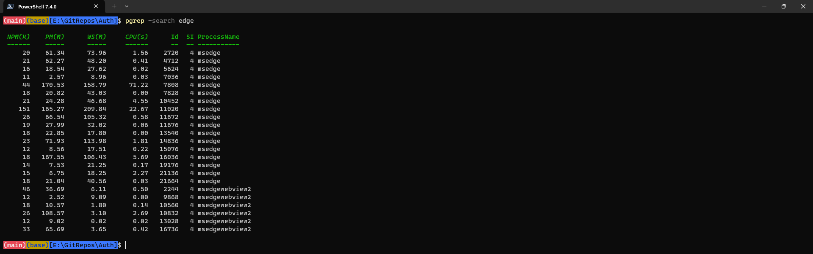
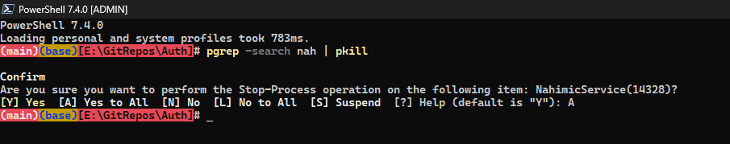

# PowerShell-Tweaks

A PowerShell customization repository built based on <a href = "https://github.com/ChrisTitusTech/powershell-profile/"> this </a> repo by ChrisTitusTech with simplicity and light-weight in mind.




## Added Aliases

gedit, n -> notepad

vim -> nvim (if you have nvim installed)

pkill -> Stop-Process

touch -> New-Item

## Added functions

### cd... and cd.... :

works similar to
`cd ..\.. `
and
`cd ..\..\..`

### md5, sha1, sha256 :

works based on the `Get-FileHash` commandlet with tags `MD5, SHA1, SHA256`

### exp :

opens explorer in the current directory

### dirs :

Does the the rough equivalent of dir /s /b. For example, dirs _.png is dir /s /b _.png

### admin (su, sudo):

Simple function to start a new elevated process. If arguments are supplied then a single command is started with admin rights; if not then a new admin instance of PowerShell is started.

### gcom and gpush:

A lazy git shortcut which executes the following code

```
function gcom {
    git add .
    git commit -m "$args"
}
```

```
function gpush {
    git add .
    git commit -m "$args"
    git push
}
```
